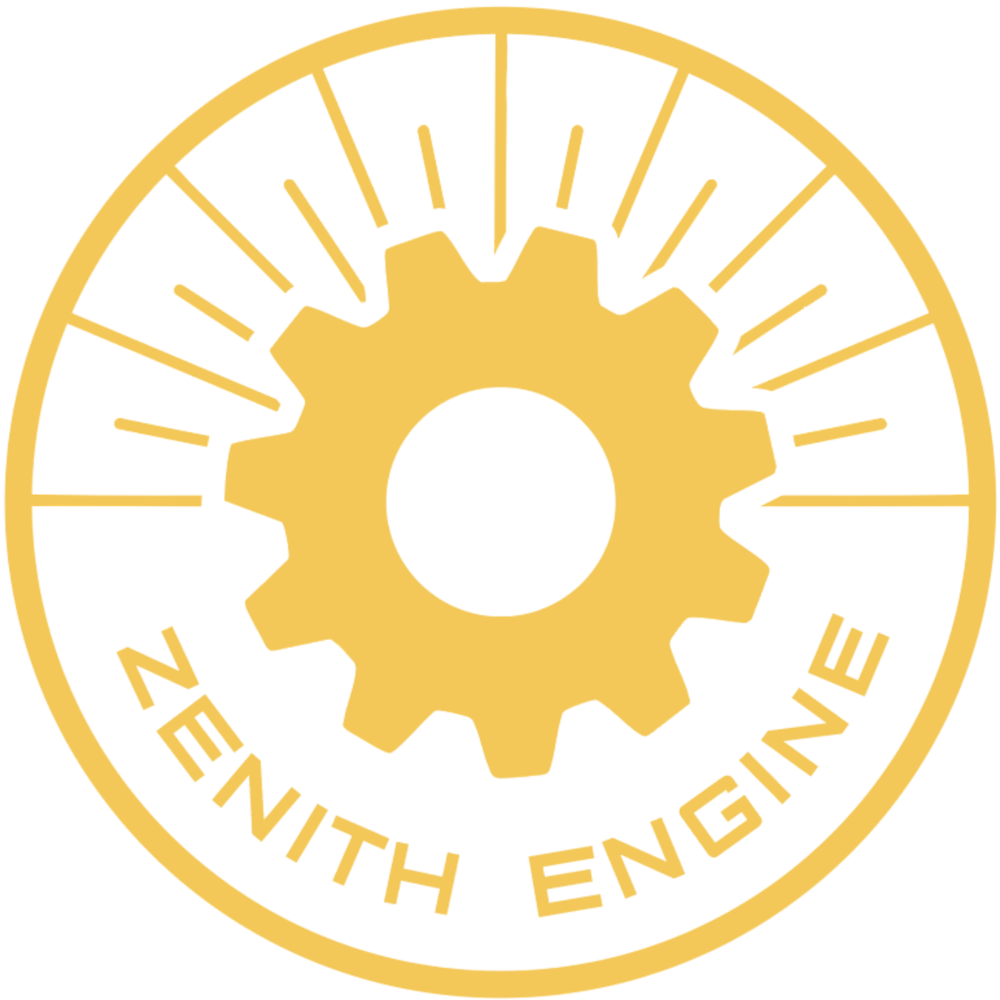

#  Zenith Engine

**Zenith Engine** is an open-source, modern C++ game engine designed for learning, prototyping, and creative projects. Built with CMake and vcpkg, it aims to be simple, modular, and cross-platform, making it easy to get started and extend.

## Features

- 🚀 **Modern C++20 codebase**
- 🖼️ **OpenGL rendering** (GLFW, GLAD, stb, glm)
- 📦 **Easy dependency management** with vcpkg
- 🗂️ **Clean project structure** (src, assets, build)
- 🛠️ **CMake-based build system** (cross-platform)
- 🧩 **Modular design** for easy extension
- 📝 **Ready for open-source collaboration**

## Getting Started

### Prerequisites
- CMake 3.20+
- A C++20 compatible compiler (MSVC, GCC, Clang)
- [vcpkg](https://github.com/microsoft/vcpkg) (included as a submodule)
- Git

### Build Instructions

```sh
# Clone the repository
 git clone --recursive <repo_url>
 cd ZenithEngine

# Install dependencies (vcpkg manifest mode)
 ./vcpkg/bootstrap-vcpkg.bat   # Windows
 ./vcpkg/bootstrap-vcpkg.sh    # Linux/macOS
 vcpkg install

# Create a build directory and generate project files
 mkdir build
 cd build
 cmake .. -G "Visual Studio 17 2022"   # Or your preferred generator

# Build the project
 cmake --build . --config Release
```

### Running
- The executable will be in `build/Release/ZenithEngine.exe` (or `build/Debug/` for debug builds).
- All assets (models, shaders, textures) are in the `assets/` folder at the project root.

## Project Structure

```
ZenithEngine/
│
├── assets/           # All models, shaders, textures, logo, etc.
│    └── Models/
│         └── ZenithEngineLogo.png
├── src/              # All C++ source code
│    └── ZenithEngine/
├── build/            # CMake build output (not in version control)
├── vcpkg/            # vcpkg submodule for dependencies
├── CMakeLists.txt    # Main build script
├── vcpkg.json        # vcpkg manifest
├── README.md         # This file
└── ...
```

## Example Usage

```cpp
#include "Model.h"

int main() {
    Shader shaderProgram("../assets/default.vert", "../assets/default.frag");
    Model model("../assets/Models/statue/scene.gltf");
    // ...
}
```

## Contributing

Contributions are welcome! Feel free to fork the repo, open issues, or submit pull requests.
- Please follow modern C++ best practices
- Keep code modular and well-documented
- Add tests/examples if possible

## License

Zenith Engine is released under the MIT License. See [LICENSE](LICENSE) for details.

## Credits

- Logo by [Your Name or Designer]
- Built with [GLFW](https://www.glfw.org/), [GLAD](https://glad.dav1d.de/), [stb](https://github.com/nothings/stb), [glm](https://github.com/g-truc/glm), [nlohmann/json](https://github.com/nlohmann/json)
